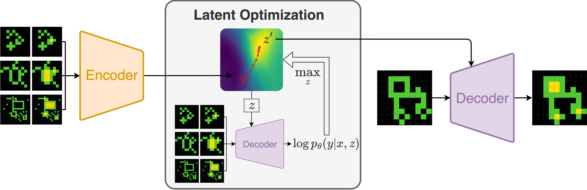

# Latent Program Network (LPN)
Code for the paper _Searching Latent Program Spaces_, 3rd paper award at [ARC Prize 2024](https://arcprize.org/competitions/2024/), and published at NeurIPS 2025 (spotlight).

Authors and maintainers: [Clément Bonnet](https://github.com/clement-bonnet) & [Matthew V Macfarlane](https://github.com/mvmacfarlane).


## Links
- [📄 arXiv paper](https://arxiv.org/abs/2411.08706)
- [🚀 Interactive Demo](https://huggingface.co/spaces/clement-bonnet/lpn)


## Overview
The LPN is an architecture for inductive program synthesis that builds in test-time adaption by learning a latent space that can be used for search.



## Installation
Install JAX using the official documentation [here](https://github.com/jax-ml/jax?tab=readme-ov-file#instructions).
Then, install the required packages using the following commands:
```bash
git clone https://github.com/clement-bonnet/lpn
cd lpn
export PYTHONPATH=${PYTHONPATH}:${PWD}
pip install -U -r requirements.txt
```
Add your secrets to the environment variables (HuggingFace token and WandB API key):
```bash
export HF_TOKEN=...
export WANDB_API_KEY=...
```


## Repository Structure
```
src/
├── configs/        # Configuration files (use with hydra)
├── datasets/       # Data processing utilities (re-arc)
├── models/         # Neural network architectures (lpn)
└── train.py        # Main training script
```


## Usage
To train a model, run the following command (replace the config name with the desired configuration):
```bash
python src/train.py --config-name pattern_2d
```


## License
This project is licensed under the open-source Apache 2.0 License. See the [LICENSE](LICENSE) file for more details.


## Citation
If you use this code in your research, please cite:
```bibtex
@misc{macfarlane2025searchinglatentprogramspaces,
      title={Searching Latent Program Spaces}, 
      author={Matthew V Macfarlane and Clement Bonnet},
      year={2025},
      eprint={2411.08706},
      archivePrefix={arXiv},
      primaryClass={cs.LG},
      url={https://arxiv.org/abs/2411.08706}, 
}
```